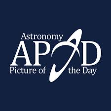
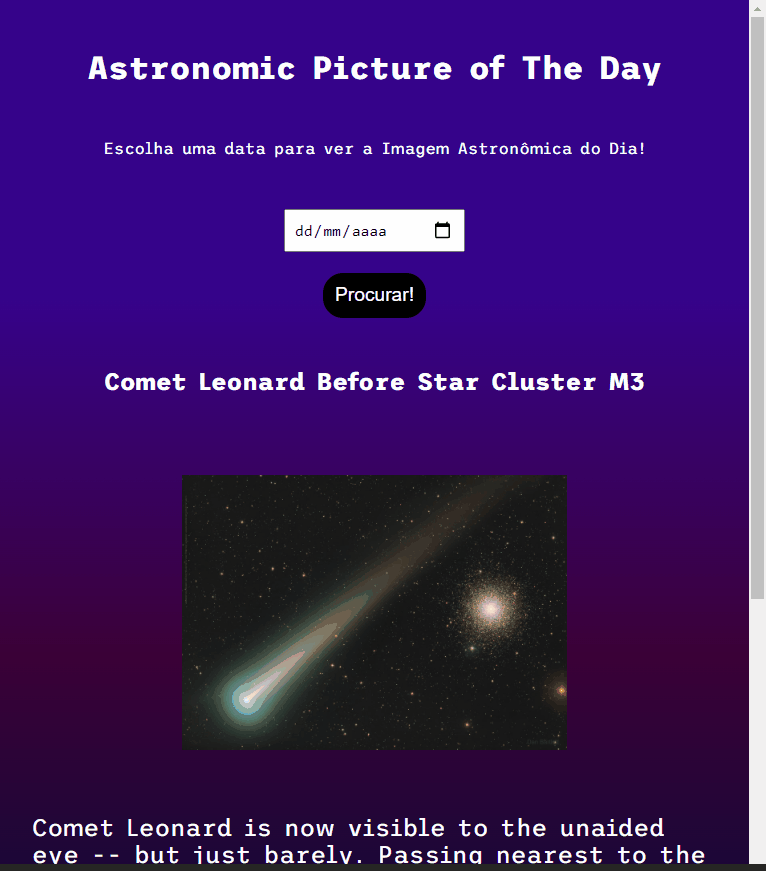

 

    

  <h3 align="center">Projeto Imagem Astronômica Do Dia by <a href="https://github.com/brunoandreotti">Bruno</a></h3>
  
  

     Projeto desenvolvido por <a class="credits" href="https://www.linkedin.com/in/bruno-andreotti-9384411b4/" target="_blank">Bruno Andreotti</a> como projeto do Módulo 2 do curso de Desenvolvedor Web FullStack da <a class="credits" href="https://www.resilia.com.br" target="_blank">Resilia Educação</a>
      

  <a href="#sobre"> Sobre </a> |
  <a href="#historia"> Como utilizar </a> |
  <a href="#rodando-o-projeto"> Acessando o projeto </a> |  
  <a href="#tecnologias-utilizadas"> Tecnologias utilizadas </a>      
        
     
    <h1 align="center">
    
 </h1>
  

# Sobre

O objetivo do projeto foi criar site para acessar a 'Imagem Astronômica Do Dia' utilizando a API APOD da Nasa com a finalidade de colocar em prática os conhecimentos de requisiçoes AJAX e jQuery que adquiri até o momento!

# Como utilizar:

- Escolha a data que deseja ver a imagem
- Clique no botão 'Procurar'
- Aprecie a imagem astronômica do dia e sua descrição

# Acessando o projeto:

Você pode acessar o projeto <a href="https://brunoandreotti.github.io/APOD-Projeto/"> clicando aqui! </a>

# Tecnologias utilizadas:

   

---

**Desenvolvido por [Bruno Andreotti](https://www.linkedin.com/in/bruno-andreotti-9384411b4/).**
